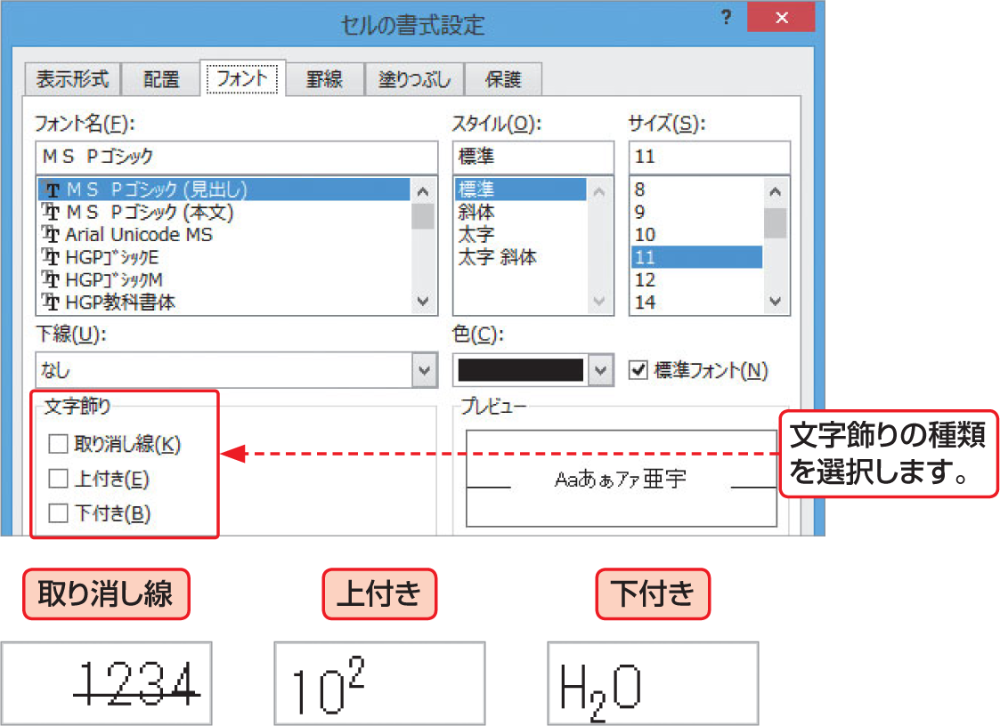

# Section 38 文字色や下線を設定する

## 文字列に下線を付ける

### [Hint] 文字飾りの種類

＜ホーム＞タブの＜フォント＞グループにある  ボタンをクリックすると、＜セルの書式設定＞ダイアログボックスの＜フォント＞タブが表示されます。このダイアログボックスの＜文字飾り＞グループでは、文字飾りを設定することができます。  
文字飾りは、3種類の中から選択できます。＜上付き＞＜下付き＞を利用すると、数式・数列や分子式なども入力できます。

