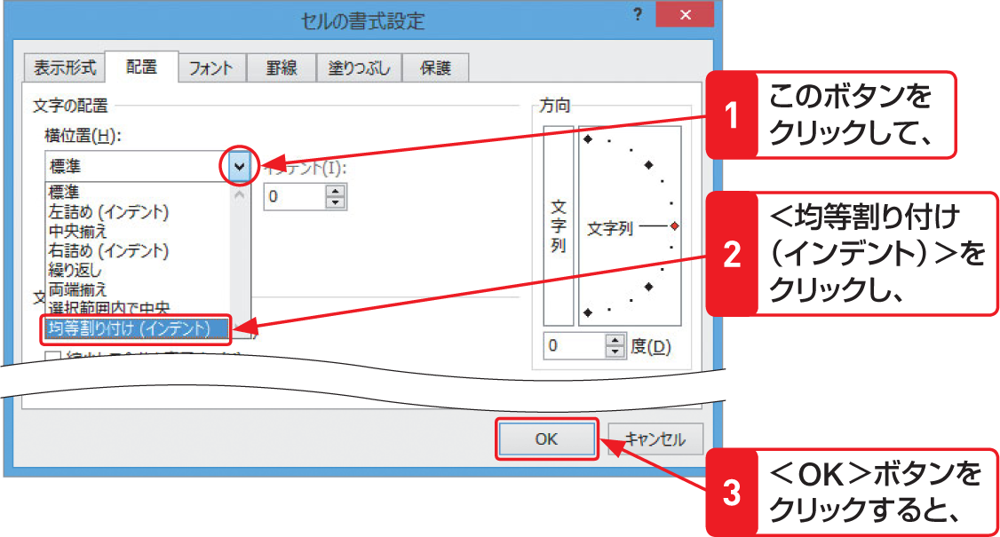

# Section 40 文字列の配置を変更する

## 文字列の大きさをセルの幅に合わせる

### [Stepup] 均等割り付けの設定

「均等割り付け」とは、セル内の文字列をセル幅に合わせて均等に配置する機能のことです。均等割り付けは、セル範囲を選択して＜セルの書式設定＞ダイアログボックスの＜配置＞タブを表示し（左ページ参照）、＜文字の配置＞グループにある＜横位置＞で設定します。  
なお、セル幅を超える文字列が入力されているセルで均等割り付けを設定すると、その文字列は折り返されます。