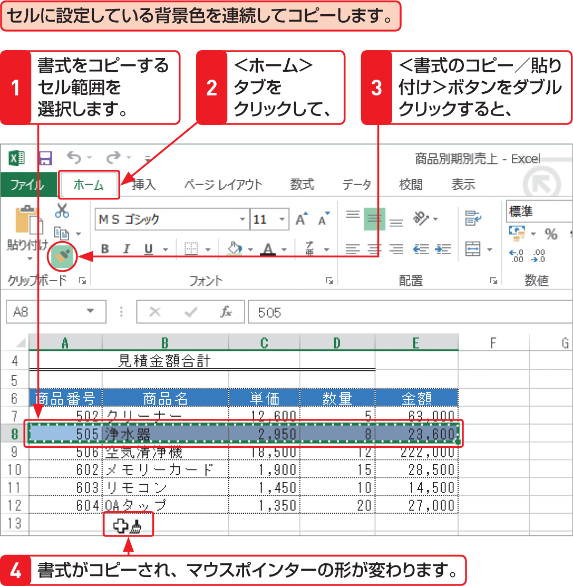

# Section 41 セルの書式だけを貼り付ける

## 書式を連続して貼り付ける

### [Memo] 書式の連続貼り付け

書式を連続して貼り付けるには、＜書式のコピー／貼り付け＞ボタン  をダブルクリックし、左の手順に従います。＜書式のコピー／貼り付け＞ボタンでは、次の書式がコピーできます。

&#9312; 表示形式  
&#9313; 文字の配置  
&#9314; フォント  
&#9315; 罫線の設定  
&#9316; 文字の色やセルの背景色  
&#9317; 文字サイズやスタイル
