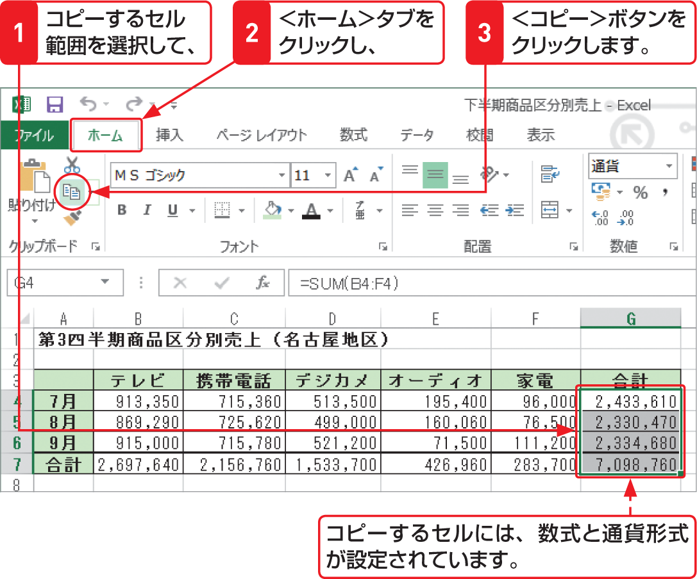

# Section 42 形式を選択して貼り付ける

## 値のみを貼り付ける

### [Memo] 値の貼り付け

＜貼り付け＞ボタンのメニューを利用すると、必要なものだけを貼り付ける、ということが簡単にできます。ここでは「値だけの貼り付け」を行います。貼り付ける形式を＜値＞  にすると、数式や数値の書式が設定されているセルをコピーした場合でも、表示されている計算結果の数値や文字列だけを貼り付けることができます。
