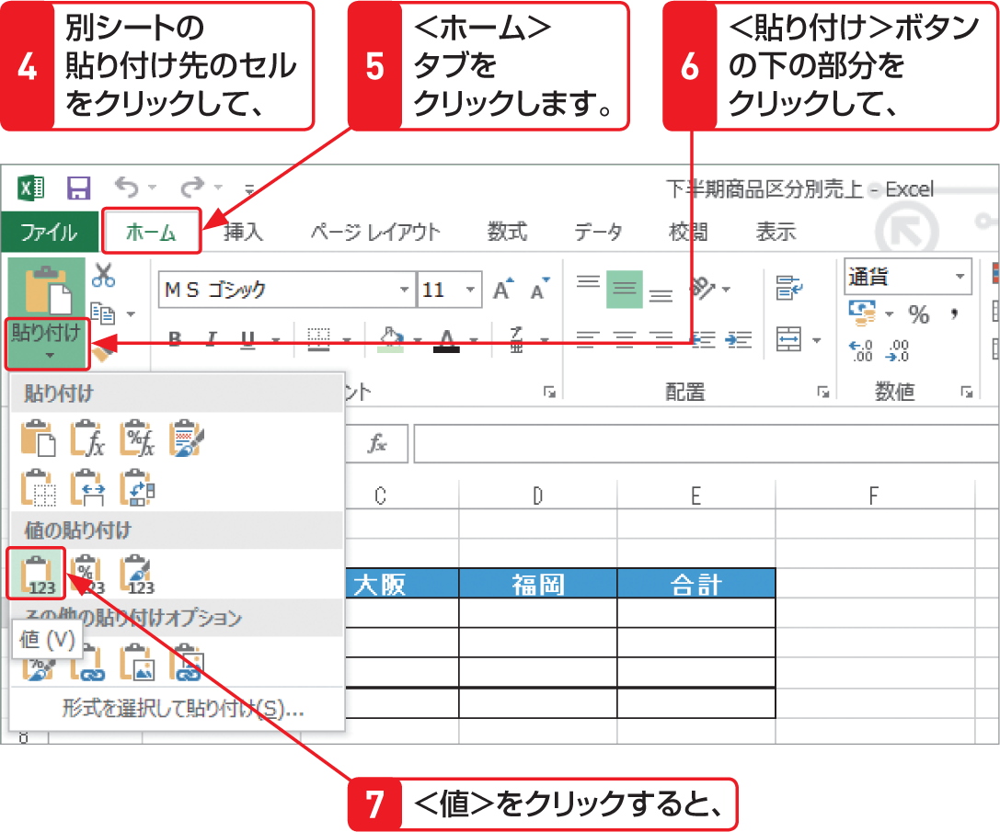

# Section 42 形式を選択して貼り付ける

## 値のみを貼り付ける

### [Memo] 他のブックへの値の貼り付け

セル参照を利用している数式の計算結果をコピーし、別のワークシートに貼り付けると、正しい結果が表示されません。これは、セル参照が貼り付け先のワークシートのセルに変更されて、正しい計算が行えないためです。このような場合は、左の手順に従い値だけを貼り付けておくと、計算結果だけを利用できます。
