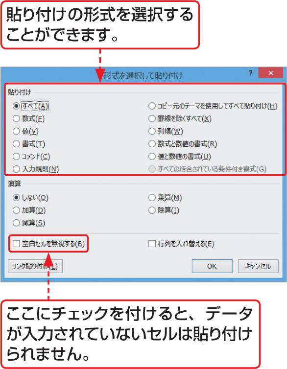

# Section 42 形式を選択して貼り付ける

## 元の列幅を保持して貼り付ける

### [Stepup] ＜形式を選択して貼り付け＞ダイアログボックス

＜貼り付け＞ボタン  のをクリックして表示される一覧から＜形式を選択して貼り付け＞をクリックすると、＜形式を選択して貼り付け＞ダイアログボックスが表示されます。このダイアログボックスを使うと、さらに詳細な条件を設定して貼り付けることができます。

