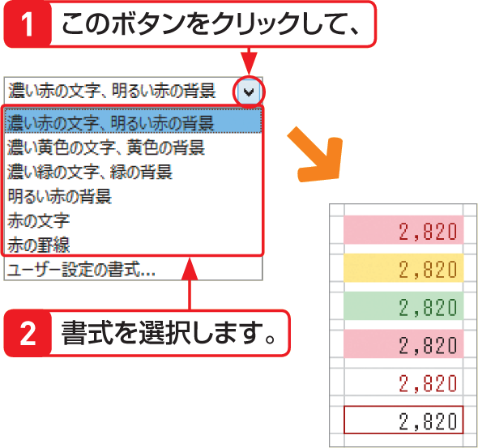

# Section 43 条件に基づいて書式を変更する

## 値を指定してセル値を評価する

### [Hint] 既定値で用意されている書式
条件付き書式の＜セルの強調表示ルール＞と＜上位／下位ルール＞では、各ダイアログボックスの＜書式＞メニューに、あらかじめいくつかの書式が用意されています。これら以外の書式を利用したい場合は、メニューの最下段の＜ユーザー設定の書式＞をクリックして、個別に書式を設定します。