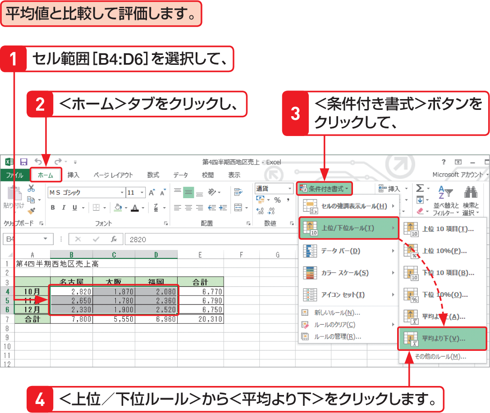

# Section 43 条件に基づいて書式を変更する

## 数値や割合または平均でセル値を評価する

### [Memo] 数値や割合を指定して評価する

条件付き書式の＜上位／下位ルール＞では、上位または下位のいくつか、あるいは数パーセントのセルに書式を設定します。値を指定して評価する場合は、通常＜セルの強調表示ルール＞で行いますが、平均値だけは、＜上位／下位ルール＞で設定するほうが簡単です。
