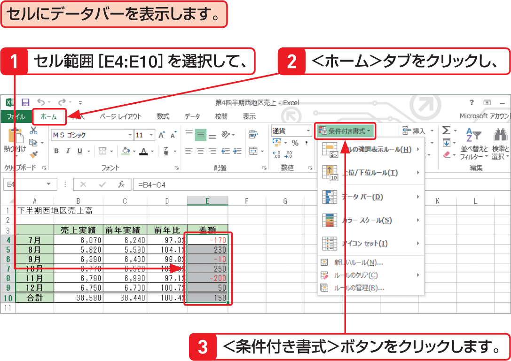

# Section 43 条件に基づいて書式を変更する

## セルの値を相対評価する

### [Memo] 条件付き書式による相対評価

条件付き書式の＜データバー＞＜カラースケール＞＜アイコンセット＞の3つの書式では、ユーザーが値を指定しなくても、選択したセル範囲の最大値・最小値を自動計算し、データを相対評価して、以下のいずれかの方法で書式を表示します。これらの条件付き書式は、データの傾向を粗く把握したい場合に便利です。

&#9312; データバー  
セルの値の大小に応じて、セルにグラデーションや単色で「カラーバー」を表示します。右の例のように境界線を適用することもできます。  
&#9313; カラースケール  
セルの値の大小に応じて、セルのカラーを切り替えます。  
&#9314; アイコンセット  
セルの値の大小に応じて、3段階・4段階または5段階で評価して、対応するアイコンをセルの左端に表示します。
