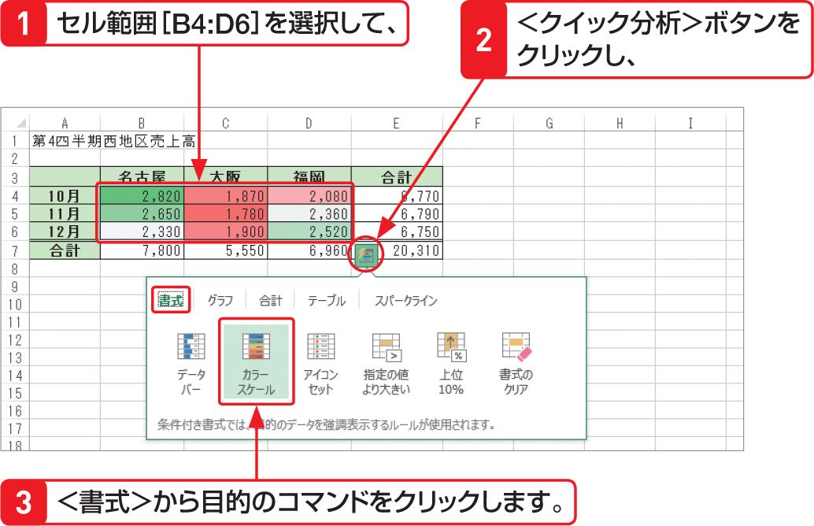

# Section 43 条件に基づいて書式を変更する

## セルの値を相対評価する

### [New] ＜クイック分析＞ボタンを利用する

条件付き書式は、Excel 2013で追加された＜クイック分析＞ボタンを使って設定することもできます。目的のセル範囲をドラッグして、右下に表示される＜クイック分析＞ボタン  をクリックし、＜書式＞から目的のコマンドをクリックします。メニューから選択するより簡単に設定できますが、選択できるコマンドの種類が限られます。

