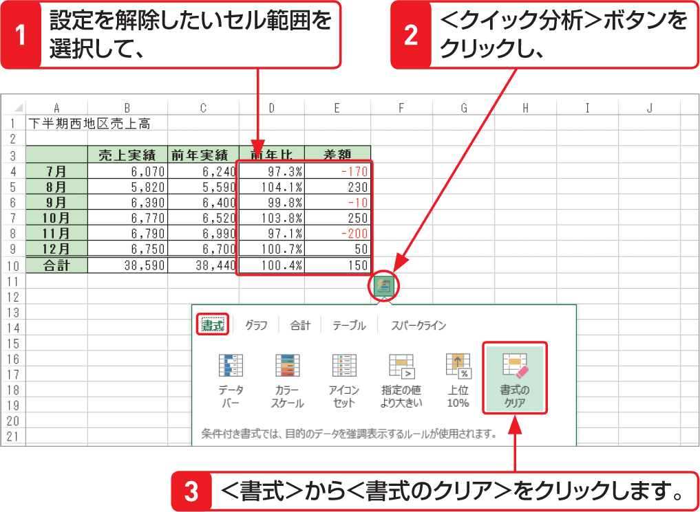

# Section 43 条件に基づいて書式を変更する

## セルの値を相対評価する

### [Hint] 条件付き書式の設定を解除するには？

設定を解除したいセル範囲を選択して、右下に表示される＜クイック分析＞ボタン  をクリックし、＜書式＞から＜書式のクリア＞をクリックします。  
また、＜条件付き書式＞ボタンをクリックして表示されるメニューの＜ルールのクリア＞から＜シート全体からルールをクリア＞をクリックしても解除できます。

