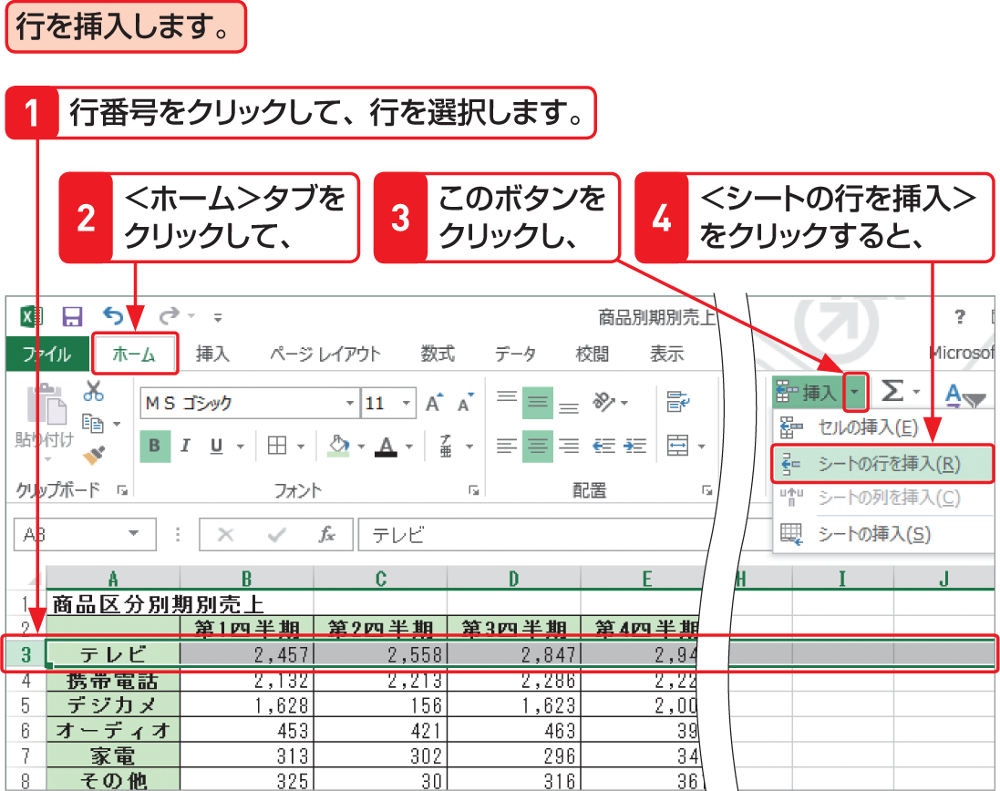
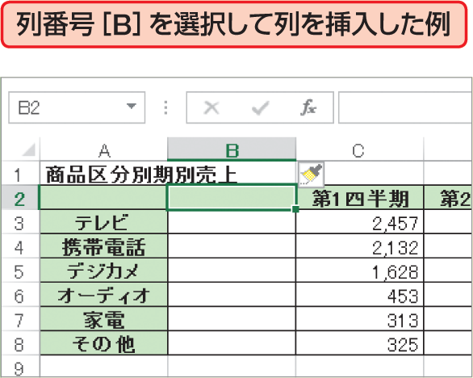

# Section 44 行や列を挿入・削除する

## 行や列を挿入する

### [Memo] 行の挿入

図の手順で行を挿入すると、選択した行の上に行が挿入され、選択した行以下の行は、1行分下方向に移動します。 

### [Memo] 列の挿入

列を挿入する場合は、列番号をクリックして列を選択し、図の手順  で＜シートの列を挿入＞をクリックすると、選択した列の左に列が挿入され、選択した列以下の列は、1列分右方向に移動します

