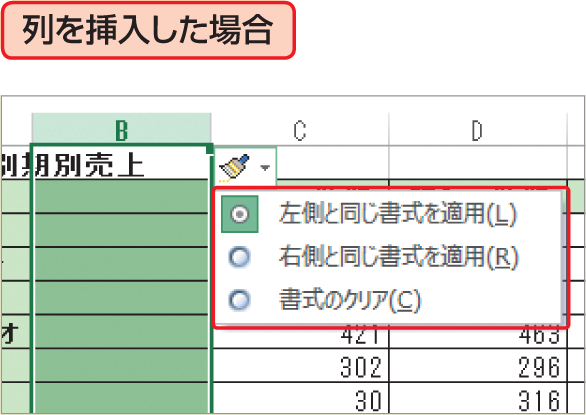

# Section 44 行や列を挿入・削除する

## 行や列を削除する

### [Hint] 挿入した行や列の書式を設定できる

挿入した行や列には、上の行（または左の列）の書式が適用されます。書式を適用したくない場合は、行や列を挿入すると表示される＜挿入オプション＞ボタン  をクリックし、挿入した行や列の書式を、下の行（または右の列）と同じ書式にしたり、書式を解除したりすることができます（左ページ参照）。

