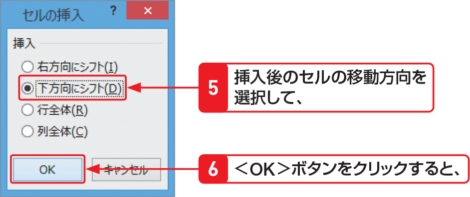

# Section 45 セルを挿入・削除する

## セルを挿入する

### [Hint] 挿入後のセルの移動方向
セルを挿入する場合は、右の手順のように＜セルの挿入＞ダイアログボックスで、挿入後のセルの移動方向を選択します。選択できる項目は次のとおりです。

&#9312; 右方向にシフト  
&emsp;選択したセルとその右側にあるセルが、右方向へ移動します。  
&#9313; 下方向にシフト  
&emsp;選択したセルとその下側にあるセルが、下方向へ移動します。  
&#9314; 行全体  
&emsp;行の挿入になります。  
&#9315; 列全体  
&emsp;列の挿入になります。
