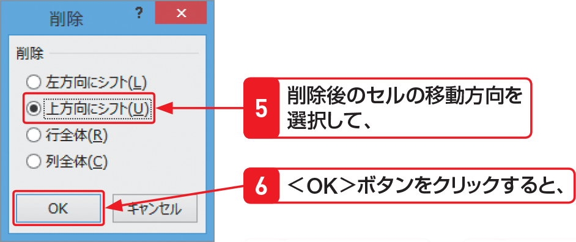

# Section 45 セルを挿入・削除する

## セルを削除する

### [Hint] 削除後のセルの移動方向

セルを削除する場合は、左の手順のように＜削除＞ダイアログボックスで削除後のセルの移動方向を選択します。選択できる項目は、次のとおりです。

&#9312; 左方向にシフト  
&emsp;削除したセルの右側にあるセルが左方向へ移動します。  
&#9313; 上方向にシフト  
&emsp;削除したセルの下側にあるセルが上方向へ移動します。  
&#9314; 行全体  
&emsp;行の削除になります。  
&#9315; 列全体  
&emsp;列の削除になります。
