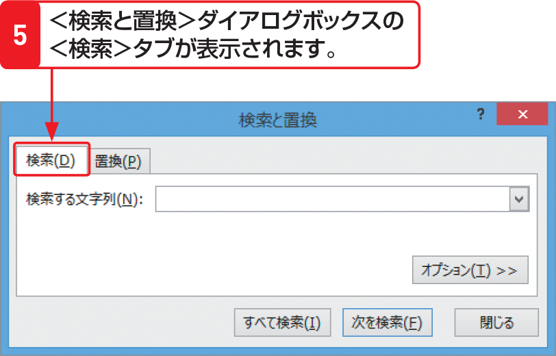

# Section 46 文字列を検索する

## ＜検索と置換＞ダイアログボックスの＜検索＞タブを表示する

### [Stepup] ワイルドカード文字

検索文字列には、ワイルドカード文字「＊（任意の長さの任意の文字）」と「?（任意の1文字）」を使用できます。たとえば「第一＊」と入力すると「第一」や「第一開発部」「第一事業部」などが検索されます。「第？研究室」と入力すると「第一研究室」や「第二研究室」などが検索されます。
