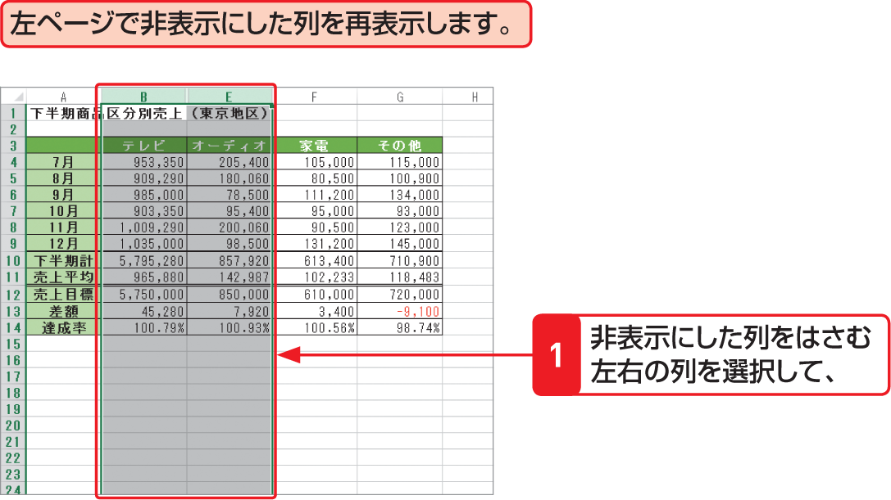

# Section 48 行や列を非表示にする

## 非表示にした列を再表示する

### [Memo] 非表示にした行や列の再表示

非表示にした列を再表示するには、非表示にした列をはさむように左右の列を選択して、左の手順に従うか、右クリックして表示されるショートカットメニューから＜再表示＞をクリックします。行の場合は、非表示の行をはさむように上下の行を選択した後、手順  で＜行の再表示＞をクリックします。
