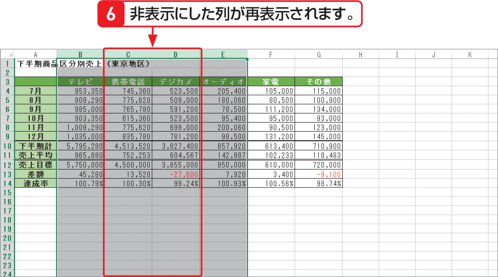
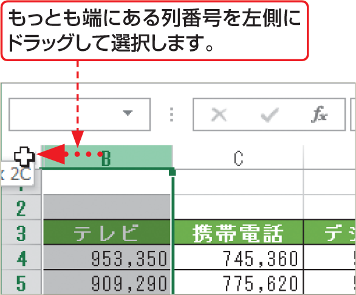

# Section 48 行や列を非表示にする

## 非表示にした列を再表示する

### [Hint] 左端の列や上端の行を再表示するには？

左端の列や上端の行を非表示にした場合は、まず、もっとも端の列番号か行番号から、ウィンドウの上あるいは左側に向けてドラッグし、非表示の列や行を選択します。次に、左の手順（左端の列の場合）に従うと、非表示にした左端の列や上端の行を再表示することができます。

