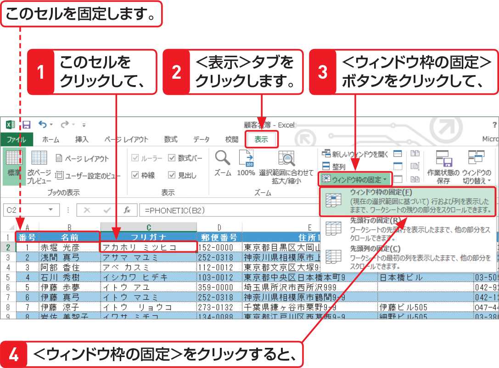

# Section 49 見出しを固定する

## 行と列を同時に固定する

### [Memo] 行と列を同時に固定
セルをクリックして＜表示＞タブの＜ウィンドウ＞グループにある＜ウィンドウ枠の固定＞ボタンをクリックし、＜ウィンドウ枠の固定＞をクリックすると、クリックしたセルの上側と左側に境界線が表示されます。  
この場合、クリックしたセルの左上のウィンドウ枠が固定されて、残りのウィンドウ枠内をスクロールすることができます。
