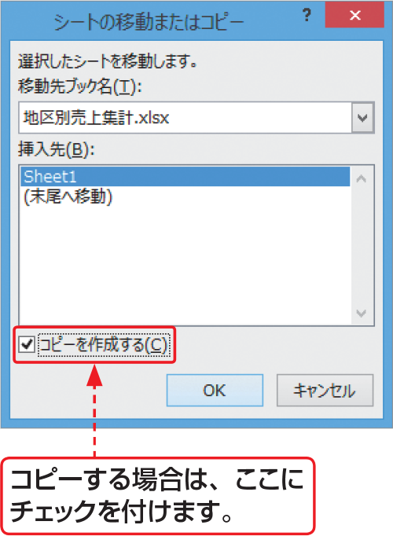

# Section 50 ワークシートを操作する

## ブック間でワークシートを移動・コピーする

### [Memo] ブック間でのシートのコピー

ブック間でワークシートをコピーするには、＜移動先ブック名＞でコピー先のブックを選択します。新しいブックにコピーする場合は、＜（新しいブック）＞を選択します。次に、＜挿入先＞でコピー先のシートを選択し、＜コピーを作成する＞にチェックを付けて、＜OK＞ボタンをクリックします。

