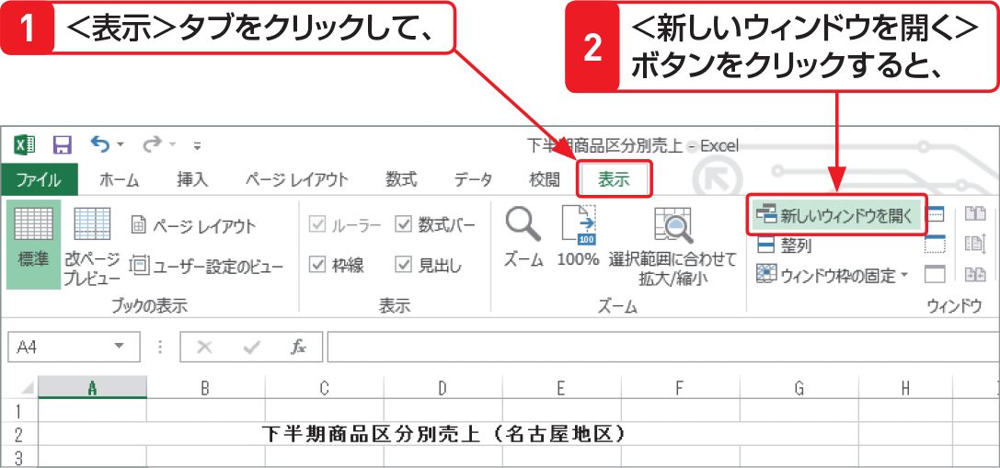

# Section 51 ウィンドウを分割・整列する

## 1つのブックを左右に並べて表示する

### [Memo] 1つのブックを複数のウィンドウで表示する

1つのブックを並べて表示すると、同じブック内にある別々のシートを比較しながら作業を行う場合などに便利です。このとき、タイトルバーに表示されるファイル名の後ろに「:1」「:2」などの番号が表示されますが、この番号は、ウィンドウを区別するためのもので、実際にファイル名が変わったわけではありません。
