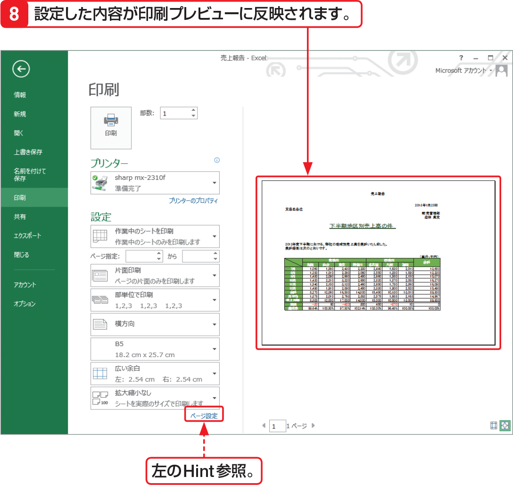
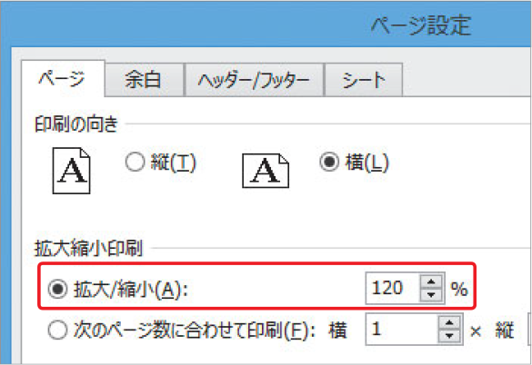

# Section 52 ワークシートを印刷する

## 印刷の向きや用紙サイズ、余白の設定を行う

### [Hint] データを拡大・縮小して印刷するには？

ワークシート上のデータを拡大あるいは縮小して印刷するには、＜印刷＞画面の下側にある＜ページ設定＞をクリックして表示される＜ページ設定＞ダイアログボックスの＜ページ＞タブで＜拡大／縮小＞を選択し、右のテキストボックスに目的の拡大／縮小率を入力します。

