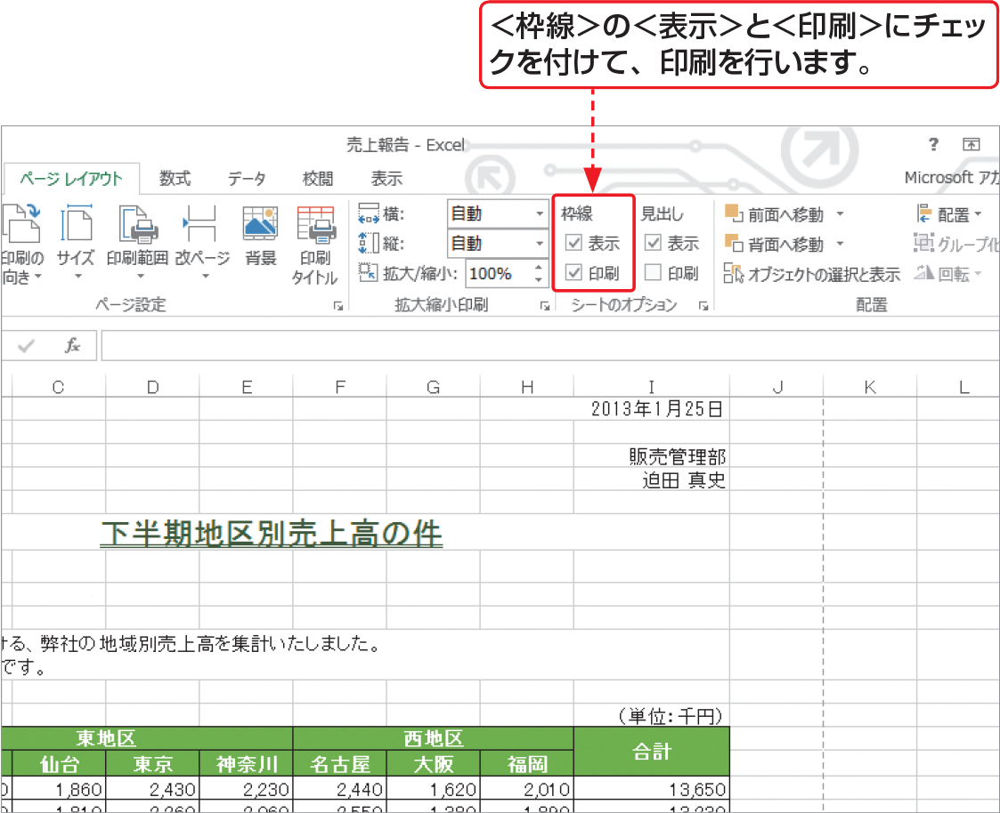

# Section 52 ワークシートを印刷する

## 印刷を実行する

### [Hint] ワークシートの枠線を印刷するには?

通常、ユーザーが罫線を設定しなければ、表の枠線は印刷されません。罫線を設定していなくても、ワークシートに枠線を付けて印刷したい場合は、＜ページレイアウト＞タブの＜シートのオプション＞グループにある＜枠線＞の＜表示＞と＜印刷＞にチェックを付けて印刷を行います。
