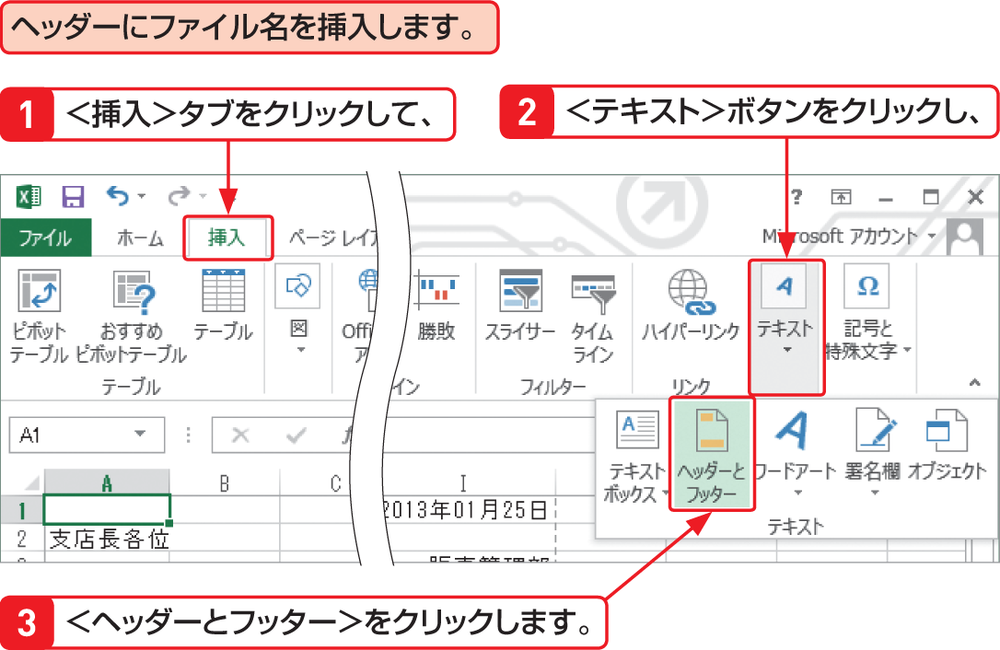

# Section 56 ヘッダーとフッターを挿入する

## ヘッダーを設定する

### [Memo] ヘッダー／フッターの設定

ヘッダーやフッターを挿入するには、図の手順に従います。なお、画面のサイズが大きい場合は、＜挿入＞タブの＜テキスト＞グループにある＜ヘッダーとフッター＞ボタンを直接クリックします。また、＜表示＞タブの＜ページレイアウト＞ボタンをクリックして、ページレイアウトビューに切り替えて、画面上のヘッダーかフッターをクリックしても同様に設定できます。
