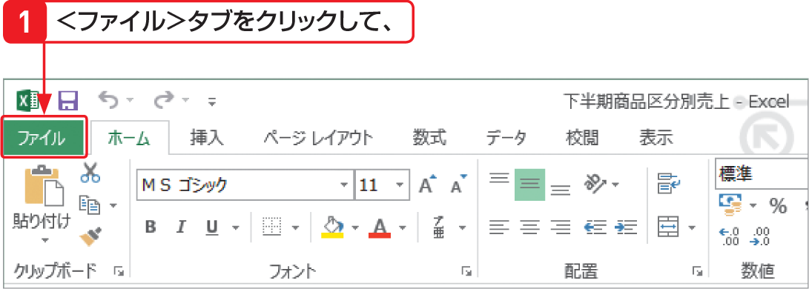

# Section 57 指定した範囲だけを印刷する

## 印刷結果を確認する

### [Stepup] 離れたセル範囲を印刷範囲として設定する

離れた場所にある複数のセル範囲を印刷範囲として設定する場合は、[key: Ctrl]キーを押しながら複数のセル範囲を選択した後に、＜印刷範囲＞ボタンをクリックして表示されるメニューから＜印刷範囲の設定＞をクリックします。なお、離れた場所にある複数のセル範囲を印刷範囲として設定した場合は、セル範囲ごとに別のページに印刷されます。
