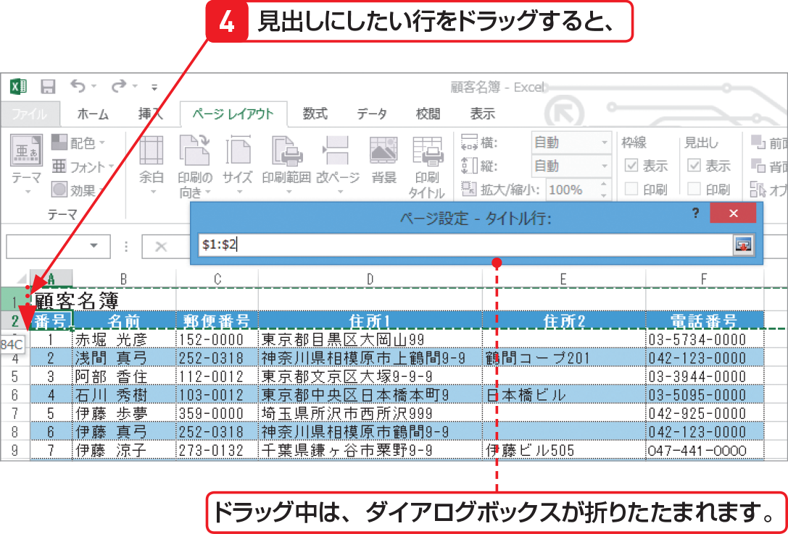

# Section 58 2ページ目以降に見出しを付けて印刷する

## 列見出しをタイトル行に設定する

### [Memo] ＜ページ設定＞ダイアログボックスが邪魔な場合は？

＜ページ設定＞ダイアログボックスが邪魔で見出しにしたい行を指定しづらい場合は、ダイアログボックスのタイトルバーをドラッグすると、移動できます。また、＜タイトル行＞や＜タイトル列＞の右側にある  ボタンをクリックすると、ダイアログボックスが折りたたまれます。再度クリックすると、元に戻ります。
