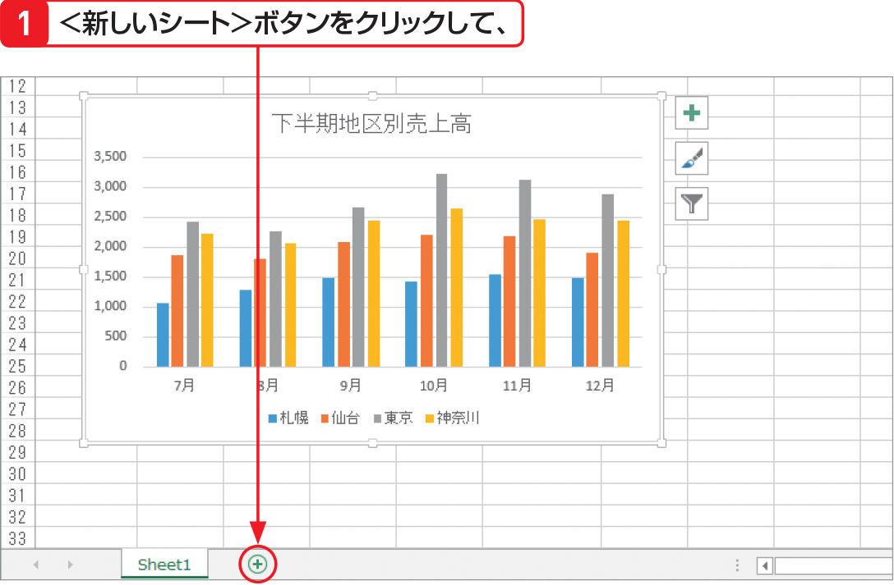

# Section 60 グラフの位置やサイズを変更する

## グラフを他のシートに移動する

### [Memo] グラフの移動先

グラフは他のシートに移動する方法と、グラフだけが表示されるグラフシートに移動する方法の2つがあります。どちらも＜グラフの移動＞ダイアログボックスから移動先を選択します。なお、他のシートに移動する場合は、移動先のシートをあらかじめ作成しておく必要があります。
