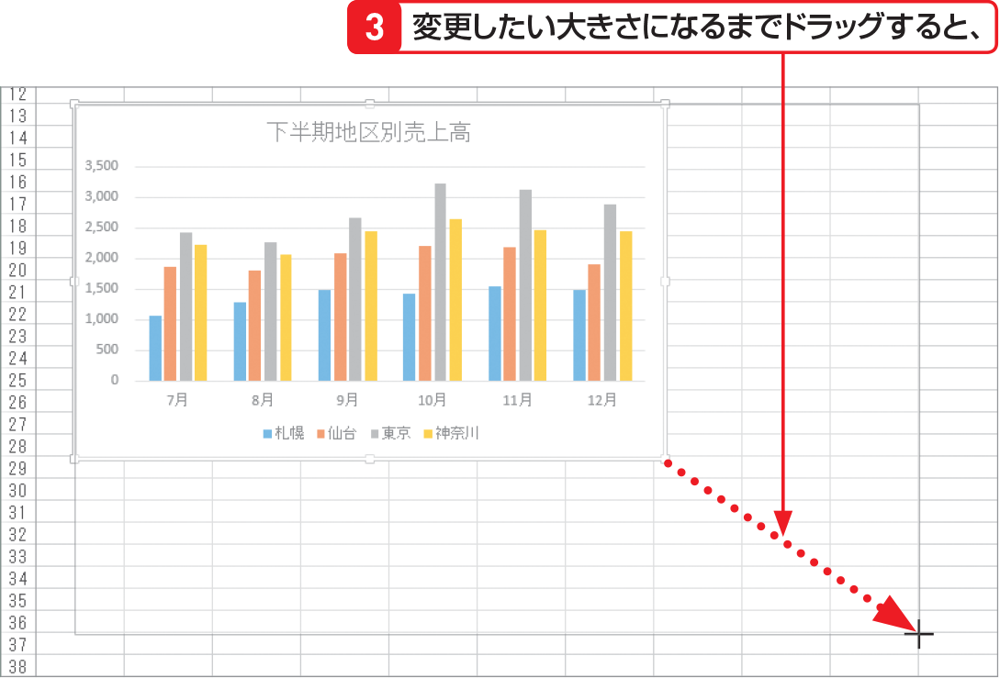

# Section 60 グラフの位置やサイズを変更する

## グラフのサイズを変更する

### [Hint] 縦横比を変えずに拡大／縮小するには？

グラフの縦横比を変えずに拡大／縮小するには、[key: Shift]キーを押しながら、グラフの四隅のサイズ変更ハンドルをドラッグします。なお、[key: Alt]キーを押しながらグラフの移動やサイズ変更を行うと、グラフをセルの境界線に合わせることができます。
