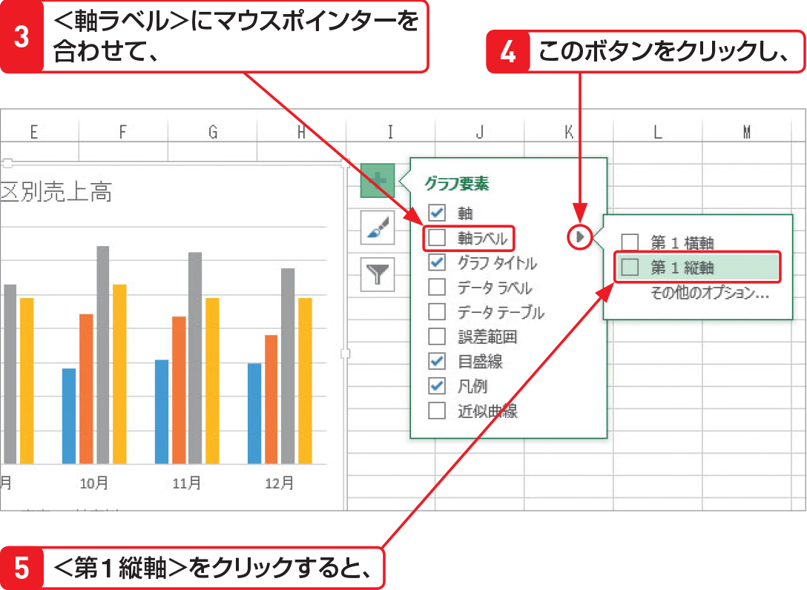
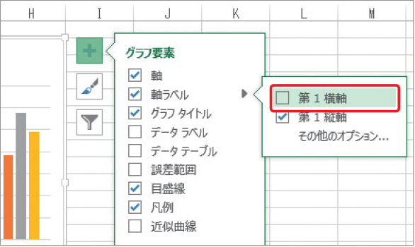

# Section 61 グラフ要素を追加する

## 軸ラベルを表示する

### [Keyword] 軸ラベル

「軸ラベル」とは、グラフの横方向と縦方向の軸に付ける名前のことです。縦棒グラフの場合は、横方向（X軸）を「横（項目）軸」、縦方向（Y 軸）を「縦（値）軸」と呼びます。

### [Hint] 横軸ラベルの表示方法

横軸ラベルを表示するには、図の＜軸ラベル＞にマウスポインターを合わせると表示される  ボタンをクリックして、＜第1横軸＞をクリックします。

