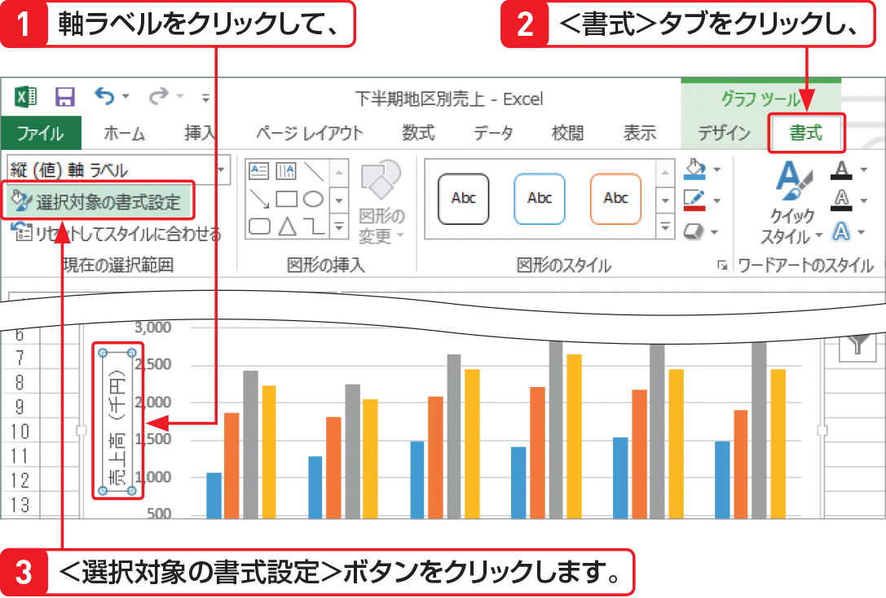

# Section 61 グラフ要素を追加する

## 軸ラベルの文字方向を変更する

### [New] 作業ウィンドウの表示

Excel 2010までは、手順  の後に書式を設定するためのダイアログボックスが表示されましたが、Excel 2013では作業ウィンドウが表示されるようになりました。作業ウィンドウの内容は、選択したグラフの要素によって変わります。なお、作業ウィンドウを閉じるときは、上の＜閉じる＞ボタン  をクリックします。
