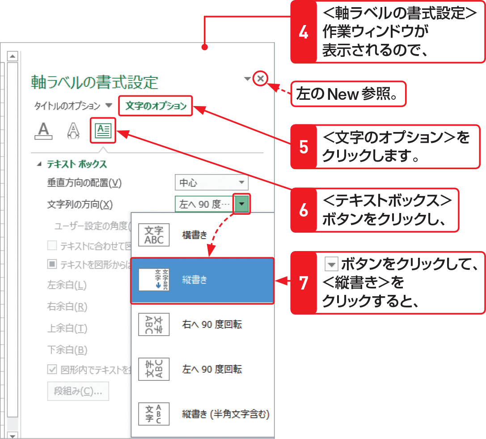
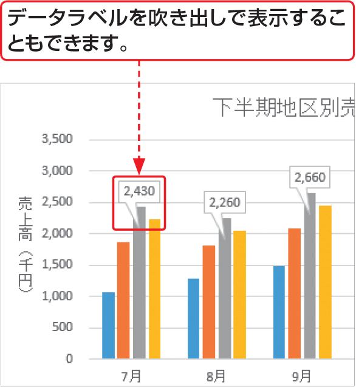

# Section 61 グラフ要素を追加する

## 軸ラベルの文字方向を変更する

### [Stepup] データラベルを表示する

グラフをクリックして、＜グラフ要素＞ボタンをクリックし、＜データラベル＞をクリックすると、グラフにデータラベルを表示することができます。特定の系列だけにラベルを表示したい場合は、表示したいデータ系列をクリックしてからデータラベルを設定します。なお、Excel 2013では、吹き出しや引き出し線を使ってデータラベルをグラフに接続することができるようになりました。また、作業ウィンドウを閉じるときは、上の＜閉じる＞ボタン  をクリックします。

