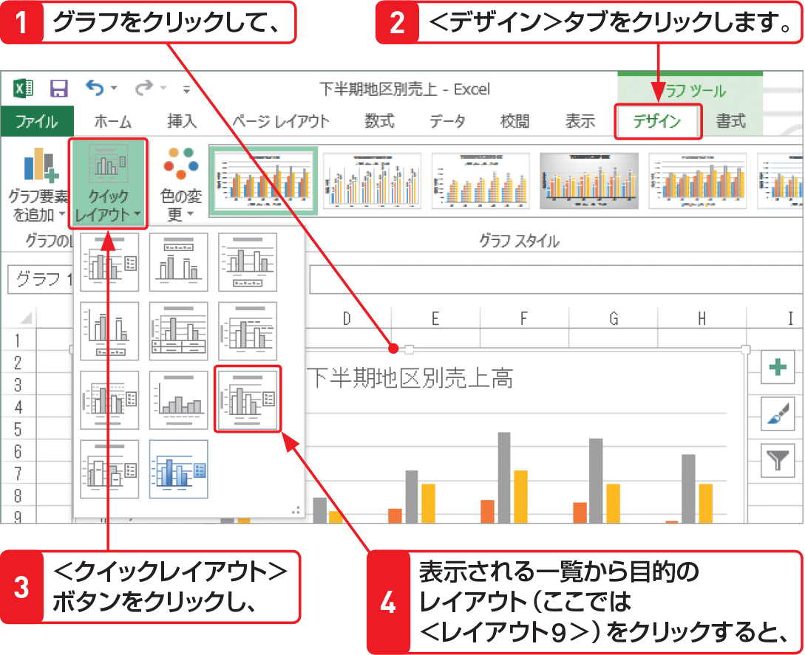
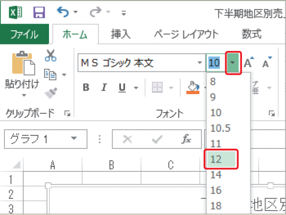

# Section 62 グラフのレイアウトやデザインを変更する

## グラフ全体のレイアウトを変更する

### [Hint] グラフ全体の文字サイズの変更

グラフにデータが入りきらない場合は、軸ラベルの文字列の方向や表示間隔が自動的に設定されます。文字がきれいに表示されない場合は、＜ホーム＞タブの＜フォント＞グループにある＜フォントサイズ＞ボックスの  ボタンをクリックして、グラフ全体の文字サイズを調整します。

