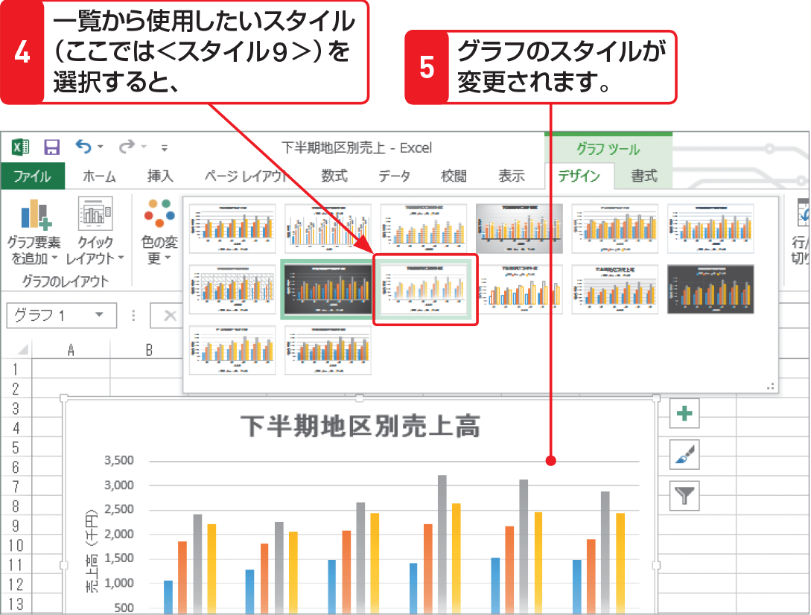

# Section 62 グラフのレイアウトやデザインを変更する

## グラフのスタイルを変更する

### [Memo] スタイルを設定する際の注意

Excelに用意されている「グラフスタイル」を適用すると、それまでに設定していたグラフ全体の文字サイズや文字フォント、タイトルやグラフエリアなどの書式が変更されてしまうことがあります。グラフのスタイルを適用する場合は、これらを設定する前に適用するとよいでしょう。
