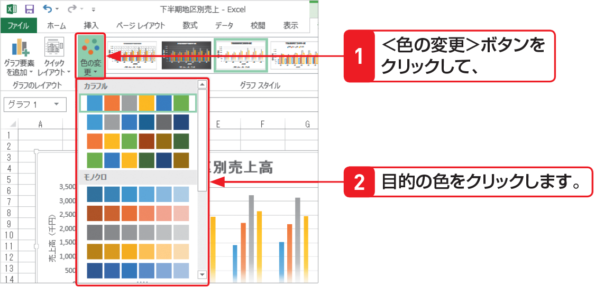

# Section 62 グラフのレイアウトやデザインを変更する

## グラフのスタイルを変更する

### [New] グラフの色を変更する

Excel 2013では、色とスタイルをカスタマイズする＜色の変更＞ボタンが追加されました。グラフをクリックして、＜デザイン＞タブをクリックし、＜グラフスタイル＞グループにある＜色の変更＞ボタンをクリックすると、色の一覧が表示されます。一覧から目的の色を選択すると、グラフ全体の色味が変更されます。

