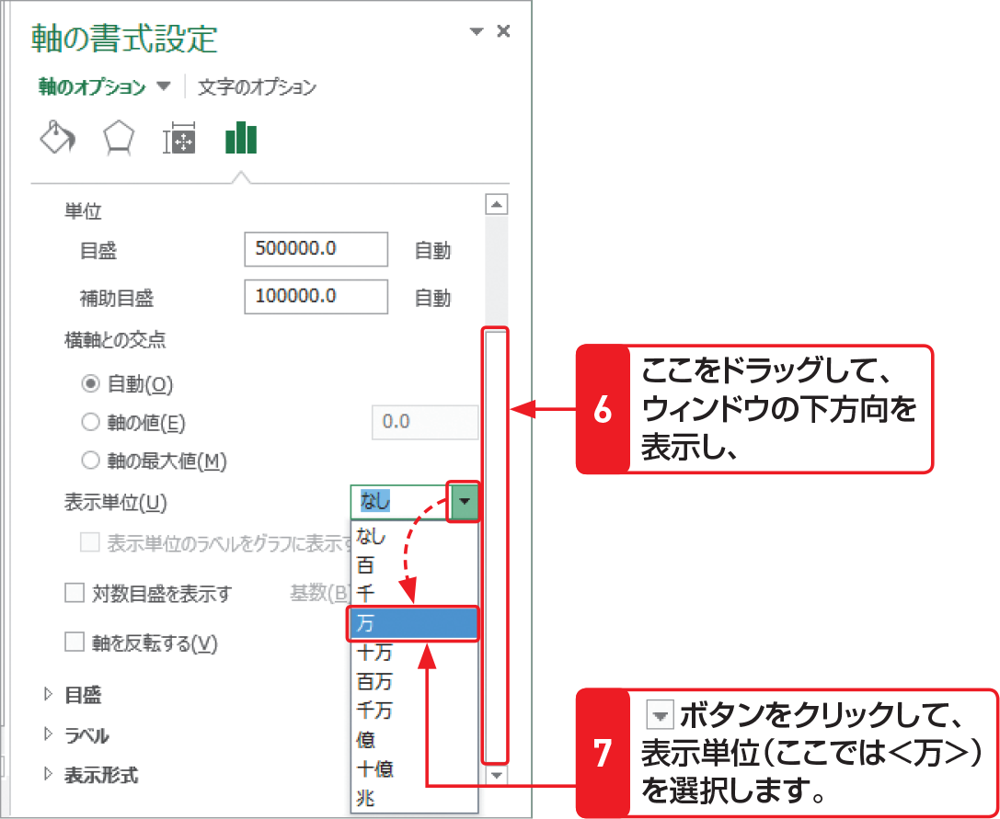

# Section 63 グラフの書式を設定する

## 縦（値）軸の目盛範囲と表示単位を変更する

### [Memo] 表示単位の設定

縦（値）軸に表示される数値の桁数が多いと、プロットエリアが狭くなり、グラフが見にくくなります。左の手順のように、縦（値）軸の表示単位を変更すると、数値の桁数を減らして、グラフを見やすくすることができます。左の例では、あらかじめ「円」を単位にしたデータをもとにしているために、表示単位を「万」にすると、実際の単位は「万」となります。また、＜表示単位のラベルをグラフに表示する＞にチェックを付けると、＜表示単位＞で選択した単位がグラフ上に表示されます。
