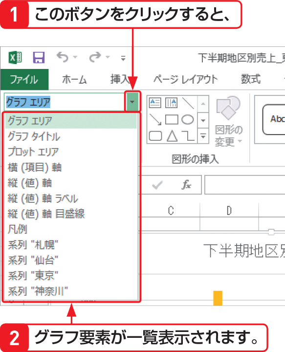

# Section 63 グラフの書式を設定する

## グラフエリアに書式を設定する

### [Stepup] さまざまなエリアで設定が可能

グラフエリアだけでなく、グラフタイトル、プロットエリア、凡例なども同様の方法で書式を設定できます。その際、左の手順のように、はじめにグラフ要素を選択してから＜選択対象の書式設定＞ボタンをクリックする他に、＜書式＞タブの＜グラフの要素＞ボックスの  ボタンをクリックし、表示される一覧でグラフ要素を選択してから、＜選択対象の書式設定＞ボタンをクリックする方法もあります。

