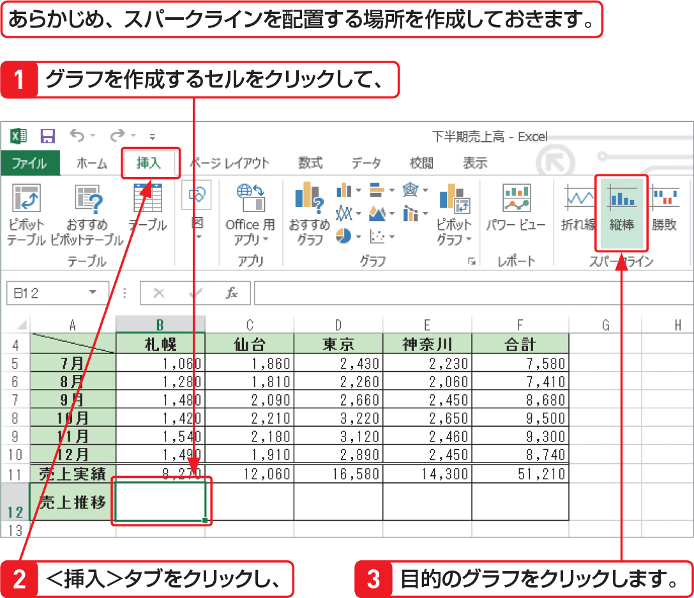

# Section 64 セルの中にグラフを作成する

## スパークラインを作成する

### [Keyword] スパークライン

「スパークライン」とは、1つのセルにおさまる小さなグラフのことで、折れ線、縦棒、勝敗の3種類が用意されています。それぞれのスパークラインは、選択範囲の中の1行分のデータに相当します。スパークラインを使用すると、データ系列の傾向を視覚的に表現することができます。
