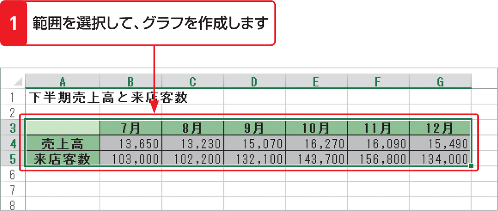

# Section 65 グラフの種類を変更する

## 複合グラフを作成する

### [Keyword] 複合グラフ

「複合グラフ」とは、1つのグラフで縦棒と折れ線などの異なる種類のグラフを組み合わせたグラフのことです。複合グラフは、グラフの値の範囲が大きく異なる場合や複数の種類のデータがある場合に使用します。左の例では、金額を単位とする売上高と人数を単位とする来店客数の推移をグラフにし、来店客数のデータ系列だけを折れ線グラフにした複合グラフを作成しています。
