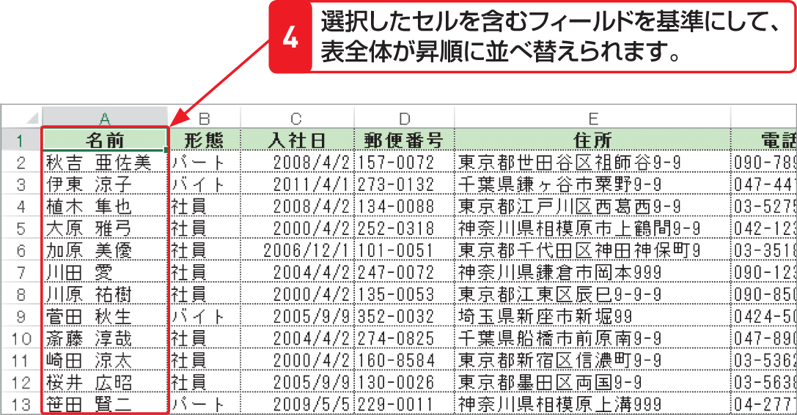

# Section 66 データを並べ替える

## データを昇順や降順に並べ替える

### [Hint] データが正しく並べ替えられない！

データベース形式の表内のセルが結合されていたり、空白の行や列があったりする場合は、表全体のデータを並べ替えることはできません。並べ替えを行う際は、表内にこのような行や列、およびセルがないかどうかを確認しておきます。また、他のセル内の文字列や、他のアプリケーションで作成したファイルのデータをコピーした場合は、ふりがな情報が保存されていないため、正しく並べ替えができないことがあるので注意が必要です。
