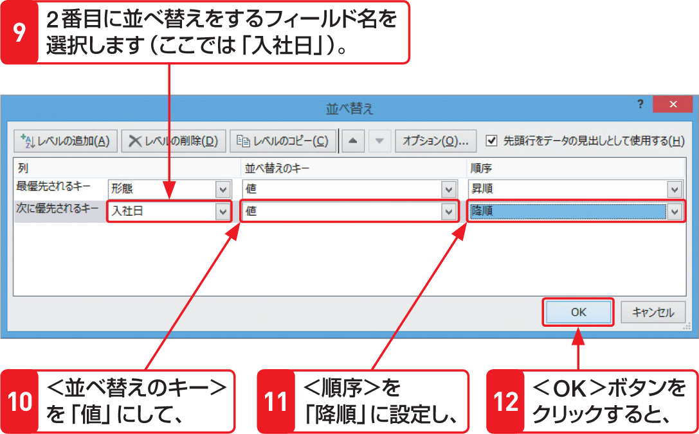
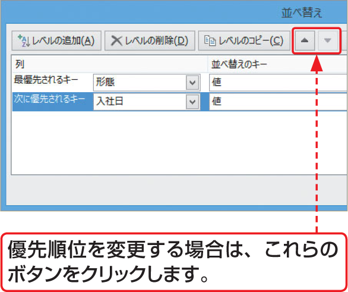

# Section 66 データを並べ替える

## 2つの条件で並べ替える

### [Hint] 2つ以上の基準で並べ替えたい場合は？

2つ以上のフィールドを基準に並べ替えたい場合は、＜並べ替え＞ダイアログボックスの＜レベルのコピー＞ボタンをクリックして、並べ替えの条件を設定する行を追加します。最大で64の条件を使用してデータを並べ替えることができます。並べ替えの優先順位を変更する場合は、＜レベルのコピー＞ボタンの右横にある＜上へ移動＞ボタン  や＜下へ移動＞  ボタンで調整することができます。

