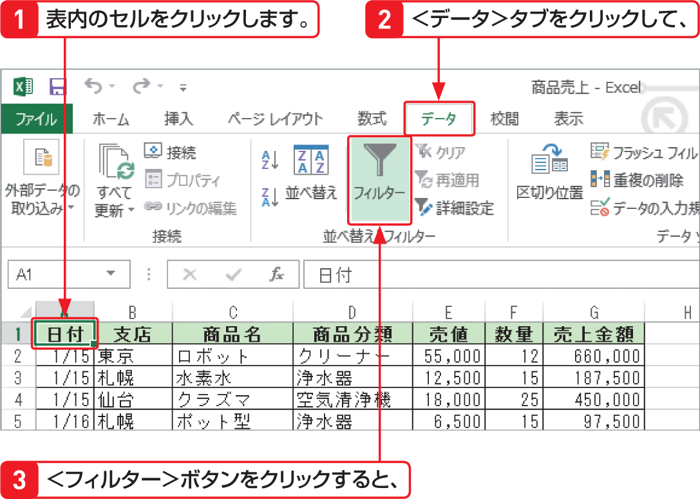

# Section 67 条件に合ったデータを抽出する

## テキストフィルターを利用してデータを抽出する

### [Memo] オートフィルターの設定と解除

＜データ＞タブの＜並べ替えとフィルター＞グループにある＜フィルター＞ボタンをクリックすると、データベース形式の表のすべての列ラベルの右横にフィルターボタン  が表示され、オートフィルターが設定されます。オートフィルターを解除する場合は、再度＜フィルター＞ボタンをクリックします。
