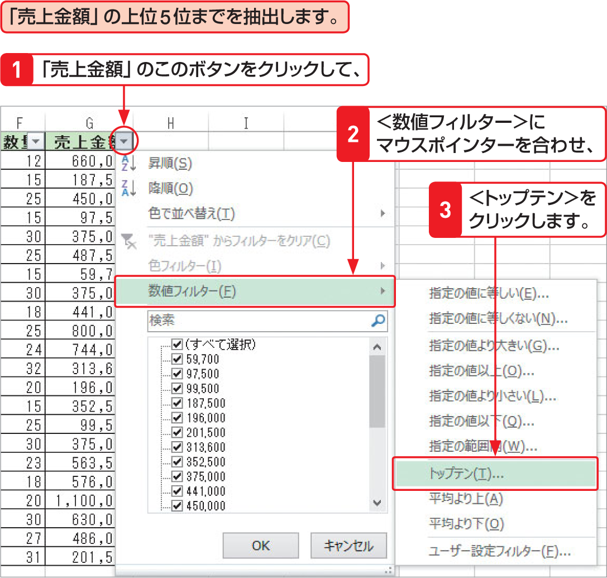

# Section 67 条件に合ったデータを抽出する

## 数値フィルターを利用してデータを抽出する

### [Memo] トップテンオートフィルターの利用

フィールドの内容が数値の場合は、トップテンオートフィルターを利用することができます。トップテンオートフィルターを利用すると、フィールド中の数値データを比較して、「上位10位」「下位10位」などのように、表示するデータを絞り込むことができます。
