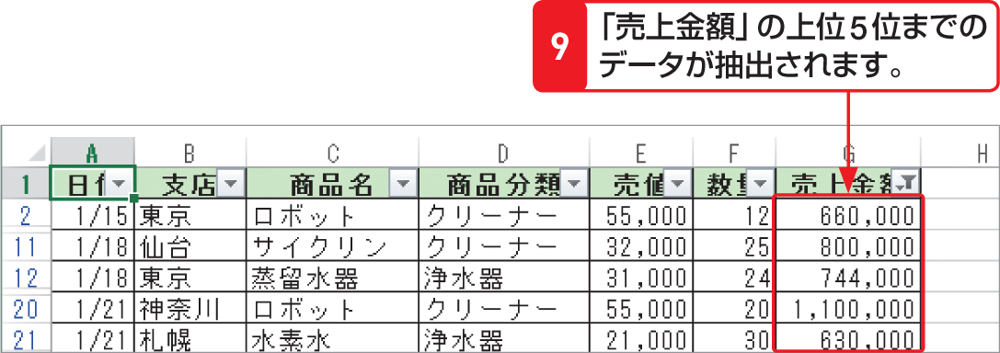

# Section 67 条件に合ったデータを抽出する

## 数値フィルターを利用してデータを抽出する

### [Hint] 項目とパーセント

＜トップテンオートフィルター＞ダイアログボックスで＜項目＞を選択すると、上位または下位から、いくつのデータを表示するかを設定できます。＜パーセント＞を選択すると、上位または下位何パーセントのデータを表示するかを設定できます。たとえば、データが30個あるフィールドで、「上位10項目」を設定すると、上位データが10個表示され、「上位10パーセント」を設定すると、30個あるデータ内の上位10パーセント、3個が表示されます。
