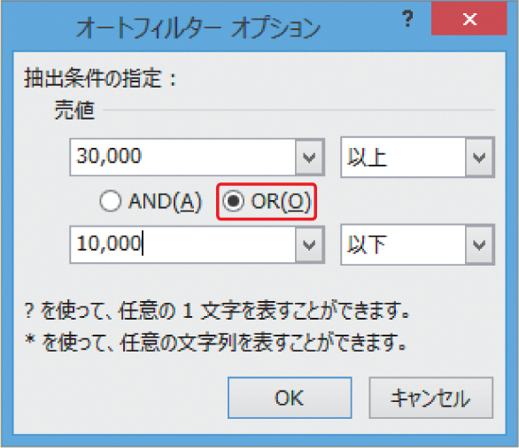

# Section 67 条件に合ったデータを抽出する

## 複数の条件を指定してデータを抽出する

### [Hint] 2つの条件を指定してデータを抽出する

＜オートフィルターオプション＞ダイアログボックスでは、1つの列に2つの条件を設定することができます。＜AND＞を選択すると両方の条件に一致するデータを表示し、＜OR＞を選択するとどちらかの条件に一致するデータを抽出します。左の例では、＜AND＞を選択しましたが、＜OR＞を選択すると、「30,000以上または10,000以下」などの2つの条件を組み合わせたデータを抽出することができます。

