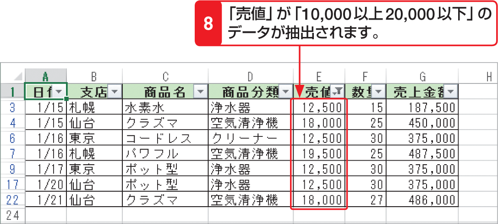

# Section 67 条件に合ったデータを抽出する

## 複数の条件を指定してデータを抽出する

### [Hint] ワイルドカード文字の利用

オートフィルターメニュー（左上段図参照）の検索ボックスで検索したり、＜オートフィルターオプション＞ダイアログボックスで「～と等しい」という条件でデータを抽出する場合は、「？」や「＊」などのワイルドカード文字が使用できます。「？」は任意の1文字を、「＊」は任意の長さの任意の文字を表します。
