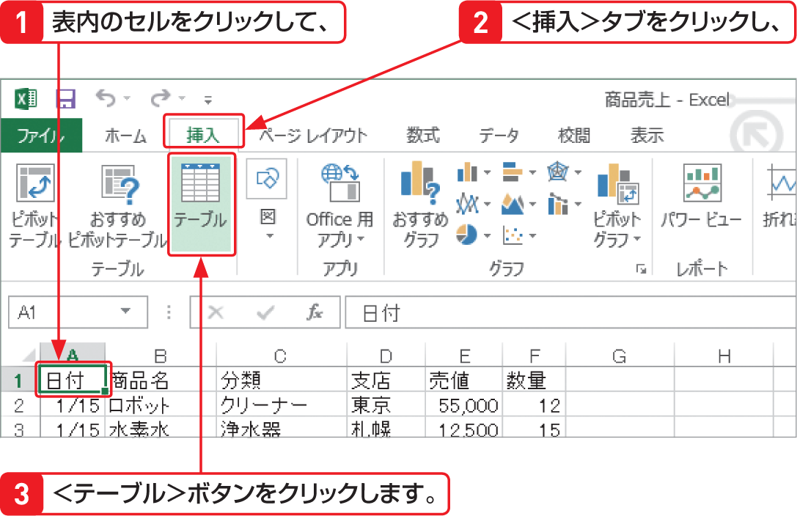

# Section 69 テーブル機能を利用する

## 表をテーブルに変換する

### [New] ＜クイック分析＞ボタンの利用

Excel 2013では、＜クイック分析＞ボタンを利用してテーブルを作成することもできます。テーブルに変換する範囲を選択すると、右下に＜クイック分析＞  ボタンが表示されます。そのボタンをクリックするとメニューが表示されるので、＜テーブル＞から＜テーブル＞をクリックします（Sec.31参照）。
