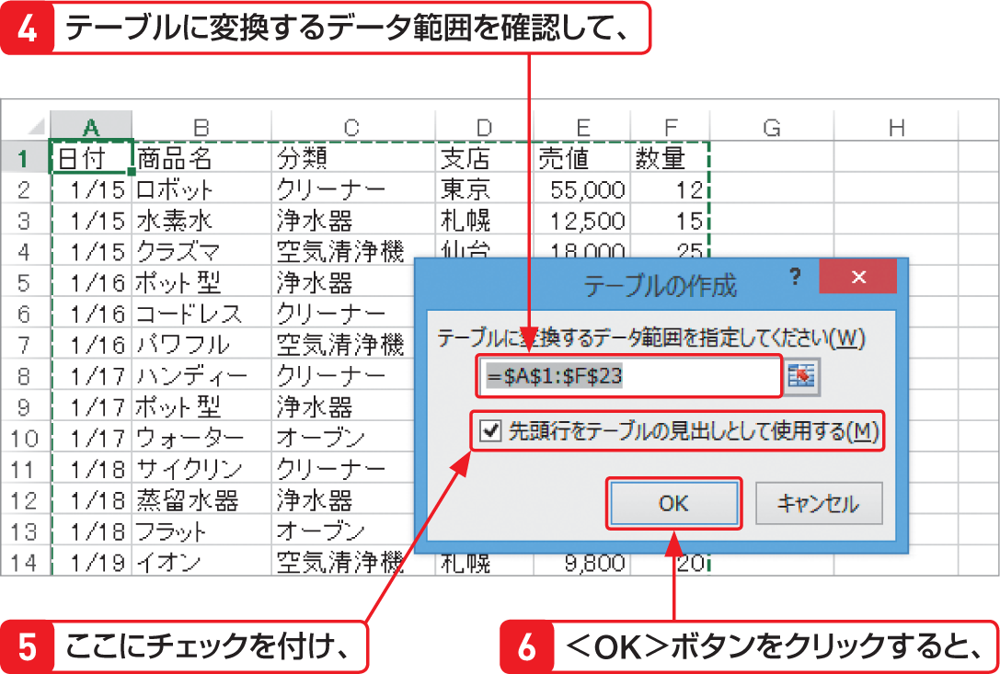

# Section 69 テーブル機能を利用する

## 表をテーブルに変換する

### [Memo] 列見出しをテーブルの列ラベルとして利用する

データベース形式の表の列見出しを、テーブルの列ラベルとして利用する場合は、＜テーブルの作成＞ダイアログボックスの＜先頭行をテーブルの見出しとして使用する＞にチェックを付けます。また、表に列見出しがない場合は、＜先頭行をテーブルの見出しとして使用する＞のチェックを外すと、先頭行の上に自動的に列ラベルが作成されます。
