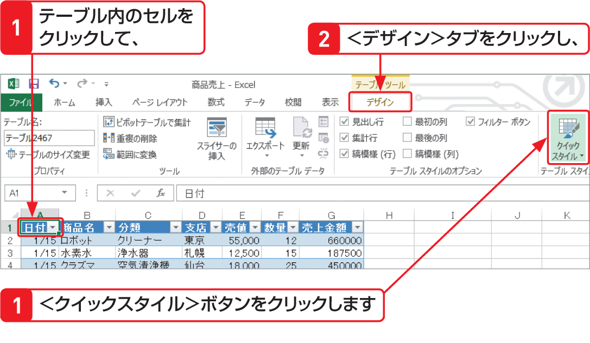

# Section 69 テーブル機能を利用する

## テーブルのスタイルを変更する

### [Memo] テーブルのスタイル

テーブルには、色や罫線などの書式があらかじめ設定されたテーブルスタイルがたくさん用意されています。スタイルは簡単に設定できるので、自分好みのスタイルを設定するとよいでしょう。なお、＜クイックスタイル＞ボタンが表示されていない場合は、＜デザイン＞タブの＜テーブルスタイル＞グループにある＜その他＞ボタン  をクリックします。
