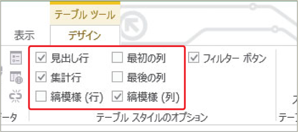

# Section 69 テーブル機能を利用する

## テーブルのスタイルを変更する

### [Hint] スタイルのオプション

＜デザイン＞タブの＜テーブルスタイルのオプション＞グループにある＜縞模様（行）＞のチェックを外して、＜縞模様（列）＞にチェックを付けると、列に対して背景色が設定されるスタイルに変更することができます。また、＜最初の列＞＜最後の列＞にチェックを付けると、集計列のスタイルが最初の列や最後の列に設定されます。

