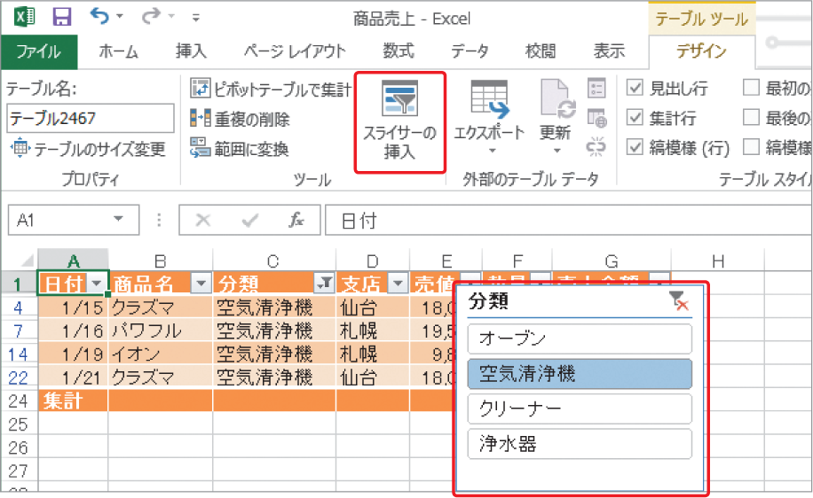

# Section 69 テーブル機能を利用する

## テーブルのスタイルを変更する

### [New] スライサーの挿入

Excel 2013では、テーブルにスライサーを追加することができます。スライサーとは、データを絞り込むことができる機能のことです。＜デザイン＞タブの＜ツール＞グループにある＜スライサーの挿入＞ボタンをクリックすると、＜スライサーの挿入＞ダイアログボックスが表示されるので、絞り込みに利用する列見出しを選択します（P.494 参照）。

